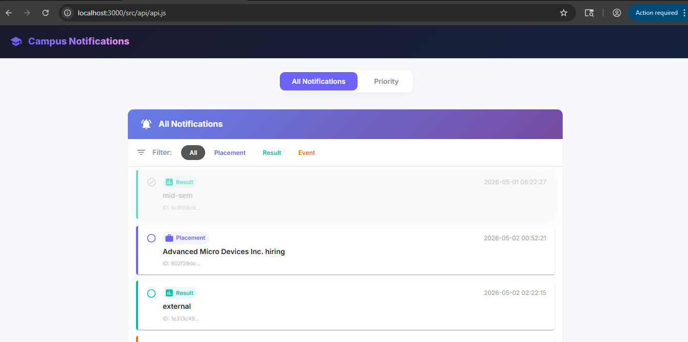
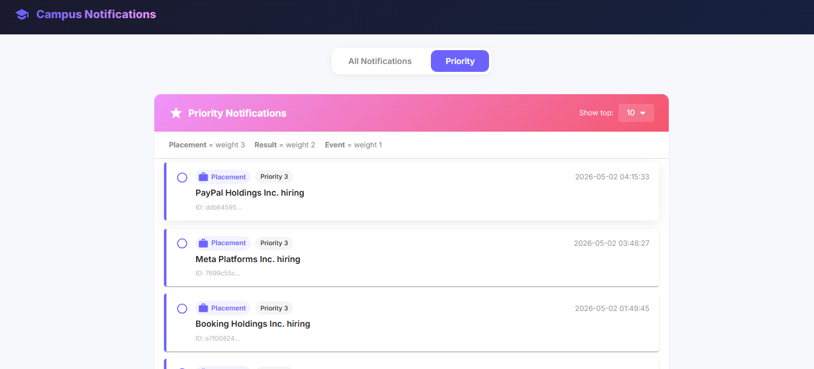

# Campus Notifications System

A robust, mobile-first notification system built with a React frontend and a Node.js logic backend. The application fetches, filters, prioritizes, and logs campus notifications securely.

## Features

- **Real-time Notifications:** Fetches notification data dynamically with pagination support.
- **Priority Engine:** Automatically sorts and ranks notifications based on weight (Placement > Result > Event) and recency.
- **Filtering:** Easily switch between all, placement, result, or event notifications.
- **Visual State Management:** Tracks read/unread status seamlessly via React Context (read notifications visually dim).
- **Custom Logging Middleware:** All application interactions, states, and errors are logged to a remote secure endpoint in the background.
- **Authentication:** All API and logging requests are protected via Bearer Token.

## Screenshots

### All Notifications Tab


### Priority Tab


## Getting Started

### Prerequisites
- Node.js (v14+ recommended)
- npm

### Installation & Setup

1. **Install Frontend Dependencies**
   ```bash
   cd notification_app_fe
   npm install
   ```

2. **Run the Development Server**
   ```bash
   npm run dev
   ```
   The frontend will be available at `http://localhost:3000`.

### Note on Authentication
The application requires a secure token to fetch notifications and submit logs. If the token expires (typically after 15 minutes), you can generate a new one by running:
```bash
node auth/getToken.js
```
Then, update the `TOKEN` variable in the following files:
- `auth/token.js`
- `notification_app_fe/src/api/logger.js`
- `notification_app_fe/src/api/notifications.js`

## Architecture & Constraints
- Designed with strict adherence to global constraints.
- Employs a custom fail-safe `Log()` function avoiding `console.log` completely.
- Uses Vite proxy to cleanly handle remote CORS restrictions.
