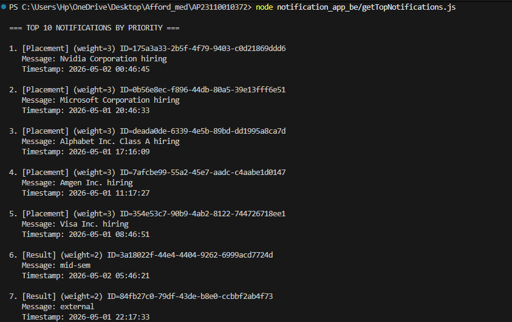
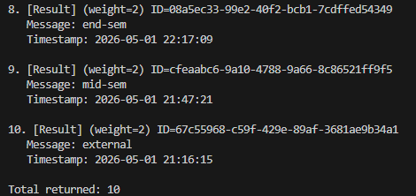

# Notification System Design

## Priority Calculation

Every notification has a **Type** and a **Timestamp**. Priority is computed using two factors:

### 1. Type Weight (Primary Sort Key)

| Type        | Weight |
|-------------|--------|
| Placement   | 3      |
| Result      | 2      |
| Event       | 1      |

Placement notifications always outrank Result, which always outrank Event — regardless of when they arrived.

### 2. Timestamp Recency (Secondary Sort Key)

Within the same type, **newer notifications rank higher**. The timestamp is parsed as a Date and compared numerically — a more recent ISO timestamp produces a larger value, so it sorts first.

### Combined Sort

```
sort by type_weight DESC, then by timestamp DESC
```

This is a stable two-key descending sort. The comparator first checks weight difference; only when weights are equal does it fall through to the timestamp comparison.

## Handling New Notifications

The system does **NOT** cache or store any data.

Every call to `getTopNotifications(N)`:

1. Makes a **fresh GET** request to the notifications API
2. Recomputes priority from scratch
3. Returns the top N results

This means:
- New notifications are automatically included on the next call
- Deleted or modified notifications are also reflected immediately
- There is no stale-data problem

This approach trades a small amount of network overhead for **guaranteed freshness**, which is the correct tradeoff for a campus notification system where timeliness matters.

## Stage 1 Output






## Why This Sorting Approach Works

1. **Correct by specification** — The two-key sort directly implements the stated priority rules: type weight first, recency second.

2. **Efficient** — JavaScript's `Array.sort()` uses TimSort (O(n log n)). For a campus notification set (typically hundreds, not millions), this is effectively instant.

## Logging Strategy

The system integrates a reusable Logging Middleware to capture all key operations.

Logs are generated for:
- API request initiation and completion
- API failures and error states
- Data parsing steps
- Priority computation and sorting
- Final result generation

Each log includes structured context (stack, level, package, message), enabling full traceability of execution.

This ensures that even without direct access to the system, issues can be diagnosed using logs alone.

## API Integration

All API calls are made to protected endpoints and require an Authorization token.

Each request includes:
Authorization: Bearer <token>

This ensures secure access to both:
- notification data
- logging service

Failure to include authentication results in request rejection.

## Error Handling

The system gracefully handles API failures:

- If notification fetch fails, an error is logged
- The system avoids crashing and can return an empty or partial result

Logging ensures failures are visible and traceable.